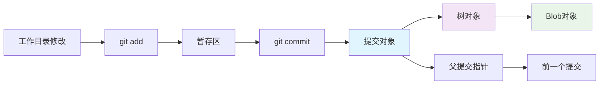

# git commit 命令的作用是什么？

# Git Commit 命令详解

## 【核心定义】
`git commit` 命令用于将暂存区（Staging Area）中的文件快照永久保存到本地仓库，创建一个新的提交记录，该记录包含提交信息、作者、时间戳和指向父提交的指针。

## 【关键要点】
1. **提交的本质是快照，不是差异**  
   Git 提交存储的是整个项目在某个时间点的完整快照，而非文件差异，这使得 Git 能够高效地进行分支切换和历史追溯。

2. **提交的三层结构**  
   - **工作目录**：实际文件所在位置
   - **暂存区**：通过 `git add` 准备好的待提交内容
   - **本地仓库**：通过 `git commit` 永久保存的提交历史

3. **提交的元数据完整性**  
   每个提交包含：唯一的 SHA-1 哈希值、作者信息、提交者信息、时间戳、提交消息和指向父提交的指针，确保历史不可篡改。

4. **提交链的形成机制**  
   每个新提交都指向其父提交，形成单向链表结构，这是 Git 版本追踪的基础数据结构。

## 【深度推导/细节】

### 数据结构实现


**Step 1 - 对象存储结构**
- **Blob 对象**：存储文件内容，相同内容只存一份
- **Tree 对象**：存储目录结构，记录文件名和对应的 Blob
- **Commit 对象**：包含树对象引用、父提交引用和元数据

**Step 2 - 提交创建过程**
1. 计算工作目录中已暂存文件的 SHA-1 哈希
2. 创建对应的 Blob 对象
3. 构建 Tree 对象描述目录结构
4. 创建 Commit 对象指向该 Tree 和父提交
5. 更新当前分支引用指向新提交

**Step 3 - 哈希链的完整性验证**
每个提交的哈希值基于其全部内容（包括父提交哈希）计算，任何历史修改都会导致后续所有提交哈希改变，这是 Git 防篡改的核心机制。

## 【关联/对比】

### Git Commit vs SVN Commit
| 特性 | Git Commit | SVN Commit |
|------|------------|------------|
| **操作位置** | 本地仓库 | 远程服务器 |
| **网络需求** | 不需要 | 必须连接 |
| **速度** | 毫秒级 | 受网络影响 |
| **原子性** | 整个项目快照 | 文件级别 |
| **回滚成本** | 极低（本地操作） | 较高（需服务器交互） |

### Git Commit 相关命令对比
- `git commit -m "消息"`：直接提交并添加消息
- `git commit --amend`：修改最近一次提交
- `git commit -a`：自动暂存已跟踪文件并提交
- `git commit --allow-empty`：允许空提交

## 【面试官追问】

### 常见追问问题：
1. **提交的 SHA-1 哈希是如何生成的？会冲突吗？**  
   哈希基于提交内容、作者、时间、父提交等计算。理论上可能冲突，但概率极低（1/2^160），实际中从未发生。

2. **为什么 Git 提交是快照而不是差异？有什么优势？**  
   快照的优势：① 分支切换极快（只需切换指针） ② 完整性验证容易 ③ 历史追溯更可靠。差异存储的优势是节省空间，但 Git 通过 Pack 文件在后台压缩解决了空间问题。

3. `git commit --amend` 的风险是什么？什么时候不能用？**  
   风险：会重写提交历史，如果已推送到远程且他人基于原提交工作，会导致协作混乱。不能用于已推送的提交（除非团队明确允许强制推送）。

4. **空提交（没有文件变更）有什么实际用途？**  
   用途：① 标记特定时间点 ② 触发 CI/CD 流程 ③ 添加或修改提交信息而不改代码。

5. **如何写出好的提交信息？有什么规范？**  
   推荐 Conventional Commits 规范：`<type>(<scope>): <subject>`，如 `feat(auth): add login validation`。类型包括：feat、fix、docs、style、refactor、test、chore。

### 直击痛点：提交设计的精妙之处

**为什么提交哈希是 40 位十六进制？**  
SHA-1 生成 160 位二进制哈希，转换为 40 位十六进制。虽然 SHA-1 已知有理论碰撞可能，但 Git 已在 2.29+ 版本支持 SHA-256，过渡方案使用 `objectFormat` 扩展。

**提交链如何保证性能？**  
- 提交对象很小（通常 200-500 字节）
- 使用 delta compression 在 pack 文件中压缩相似对象
- 引用日志（reflog）提供高效的历史导航

**多父提交（合并提交）的数据结构**  
合并提交包含两个父提交指针，形成分叉合并的 DAG（有向无环图）结构：
```
      C (合并提交)
     / \
    A   B
     \ /
      D (共同祖先)
```

## 【版本差异】

### Git 1.7.2+ 的重要改进
- 引入 `git commit --verbose`：在编辑器中显示差异
- 改进的提交模板支持

### Git 2.9.0+ 的功能增强
- `commit.gpgSign` 配置支持自动签名提交
- 更好的提交消息换行处理

### Git 2.23+ 的现代特性
- 引入 `git switch` 和 `git restore`，分离了分支切换和文件恢复功能，使 `git commit` 的职责更清晰

### 最佳实践总结
1. **原子性提交**：每个提交只做一件事，便于回滚和代码审查
2. **描述性消息**：用现在时、祈使句，说明「为什么」而不仅是「做了什么」
3. **签名验证**：对重要提交使用 GPG 签名
4. **交互式变基**：使用 `git rebase -i` 整理提交历史后再推送

---

**技术要点回顾**：`git commit` 不仅是保存更改的命令，更是 Git 分布式版本控制系统的核心机制，其快照式存储、哈希链完整性、分支轻量级特性共同构成了 Git 高效强大的基础。理解提交的内部数据结构（Blob-Tree-Commit）是掌握 Git 高级操作的关键。
